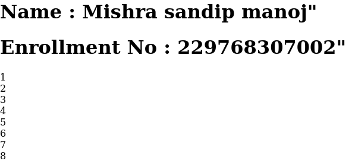
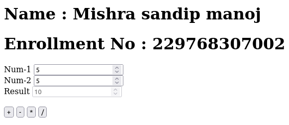
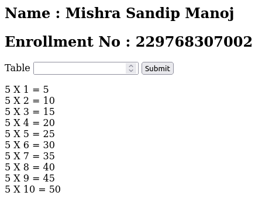
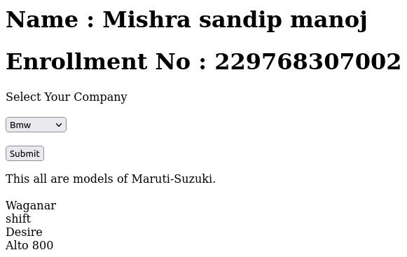
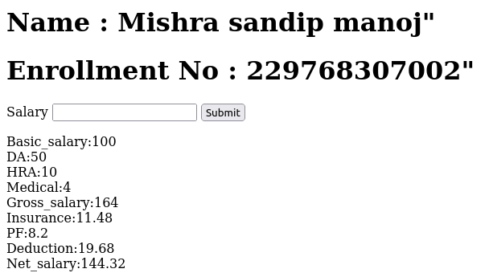
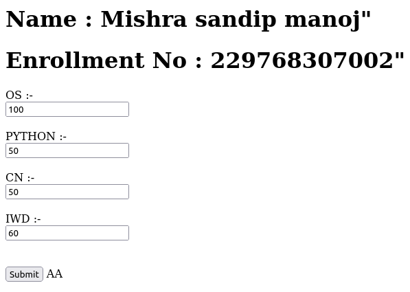
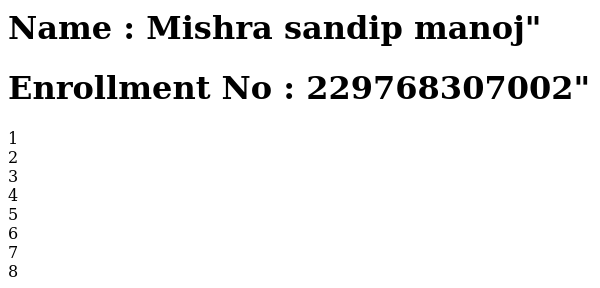

# 📝 PHP Assignment

🔮 Embark on a magical journey through PHP and elevate your coding skills with these captivating assignments! 🚀👩‍💻👨‍💻

## Section 1-10: **Foundations of PHP Sorcery**

1. **Fibonacci Numbers** 🌸
   - Unveil the secrets of Fibonacci numbers up to the given term.
   - [Link](./1.php)
   - **Input:**
     
   - **Output:**
     

2. **String Fusion** 🎵
   - Merge two strings into a harmonious composition.
   - [Link](./2.php)
   - **Input:**
     
   - **Output:**
     

3. **Multiplication Magic** 🌟
   - Conjure the multiplication table for any chosen number.
   - [Link](./3.php)
   - **Input:**
     
   - **Output:**
     

4. **Simple Math Wizardry** 🔢
   - Create a Simple Calculator for mystical mathematical operations.
   - [Link](./4.php)
   - **Input:**
     
   - **Output:**
     

5. **Car Detective** 🚗
   - Uncover the enigma of car names and reveal the company they are bound to.
   - [Link](./5.php)
   - **Input:**
     
   - **Output:**
     

6. **Salary Sorcery** 💰
   - Calculate the net payment for an employee.
   - [Link](./6.php)
   - **Input:**
     
   - **Output:**
     

7. **Subject Mastery** 📚
   - Read marks of 4 subjects and unveil the result.
   - [Link](./7.php)
   - **Input:**
     
   - **Output:**
     

8. **String Insights** 🧐
   - Decipher string length and word count without string functions.
   - [Link](./8.php)
   - **Input:**
     
   - **Output:**
     

9. **String Prowess** 📊
   - Calculate string length and word count using string functions.
   - [Link](./9.php)
   - **Input:**
     
   - **Output:**
     

10. **Array Adventure** 🎲
    - Embark on a journey of array enchantment and sort a given indexed array.
    - [Link](./10.php)
    - **Input:**
      
    - **Output:**
      
