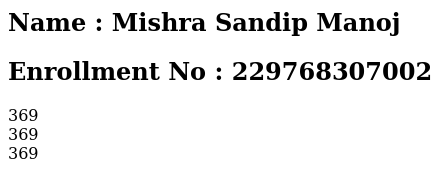
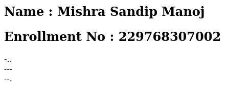
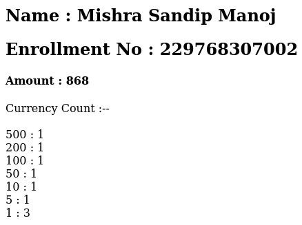
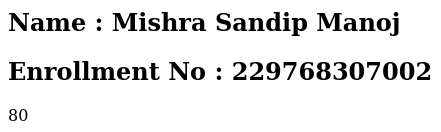
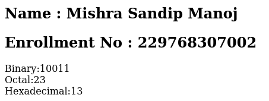
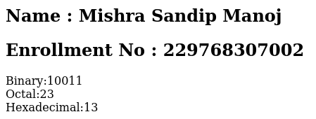
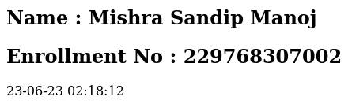

# 📝 PHP Assignment

🔮 Embark on a magical journey through PHP and elevate your coding skills with these captivating assignments! 🚀👩‍💻👨‍💻

## Section 11-20: **String Enchantment & Beyond**

11. **Matrix Mastery** 🧮
   - Unleash the matrix magic by performing 3 x 3 matrix multiplication.
   - [Link](./11-20/11.php)
   - **Input:**
     
   - **Output:**
     

12. **Morse Code Magic** 🌐
   - Encode messages into Morse code, bridging the gap between ancient and modern communication.
   - [Link](./11-20/12.php)
   - **Input:**
     
   - **Output:**
     

13. **Currency Conundrum** 💵
   - Navigate the labyrinth of currency denominations and compute the optimal notes combination for any amount.
   - [Link](./11-20/13.php)
   - **Input:**
     
   - **Output:**
     

14. **String Case Sleuth** 🔠
   - Embark on a journey of linguistic investigation and unveil whether a string is in lowercase or not.
   - [Link](./11-20/14.php)
   - **Input:**
     
   - **Output:**
     

15. **String Reversal Reveal** ↩️
   - Unravel the secrets of strings by mastering the art of reversal.
   - [Link](./11-20/15.php)
   - **Input:**
     
   - **Output:**
     

16. **Whitespace Wipeout** ✂️
   - Wave your wand of PHP and wipe out whitespace from strings, making them pure and clean.
   - [Link](./11-20/16.php)
   - **Input:**
     
   - **Output:**
     

17. **Randomness Unleashed** 🎲
   - Harness the power of randomness and generate magical numbers within a given range.
   - [Link](./11-20/17.php)
   - **Input:**
     
   - **Output:**
     

18. **Number Notation Novelties** 🧮
   - Unlock the language of numbers and explore binary, octal & hexadecimal notations of decimal numbers.
   - [Link](./11-20/18.php)
   - **Input:**
     
   - **Output:**
     

19. **Trig Triumph** 📐
   - Immerse yourself in the cosmic dance of trigonometric functions and unleash the magic of sine, cosine & tangent.
   - [Link](./11-20/19.php)
   - **Input:**
     
   - **Output:**
     

20. **Time Traveler** 🕰️
   - Manipulate the threads of time itself and display the current date and time in various mystical formats.
   - [Link](./11-20/20.php)
   - **Input:**
     
   - **Output:**
     
