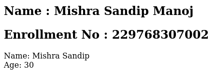
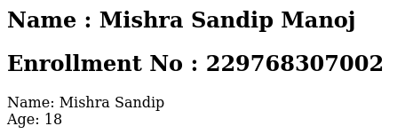
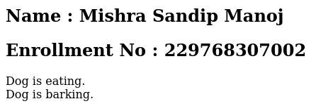
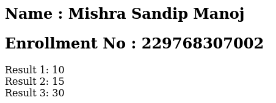

# 📝 PHP Assignment

🔮 Embark on a magical journey through PHP and elevate your coding skills with these captivating assignments! 🚀👩‍💻👨‍💻

## Section 21-30: **Epic Object-Oriented Quest**

21. **Class Crafting** 🏗️
   - Embark on a quest of class construction, weaving the foundations of your magical PHP journey.
   - [Link](./21-30/21.php)
   - **Input:**
     
   - **Output:**
     

22. **Object Odyssey** 🚀
   - Set forth on an odyssey of objects, traversing public properties and invoking powerful methods.
   - [Link](./21-30/22.php)
   - **Input:**
     
   - **Output:**
     

23. **Attribute Adventure** 🔑
   - Dive into the realm of attributes, unveiling private treasures using the ancient arts of set and get methods.
   - [Link](./21-30/23.php)
   - **Input:**
     
   - **Output:**
     

24. **Inheritance Insight** 🧬
   - Gaze upon the reflection of inheritance, a single thread connecting generations of classes.
   - [Link](./21-30/24.php)
   - **Input:**
     
   - **Output:**
     

25. **Multiple Heritage** 🧬🧬
   - Embrace the complexity of multiple inheritance, where the lineage of classes weaves intricate patterns.
   - [Link](./21-30/25.php)
   - **Input:**
     
   - **Output:**
     

26. **Inheritance in Layers** 🎂🧬
   - Ascend the steps of multilevel inheritance, reaching higher planes of class relationships.
   - [Link](./21-30/26.php)
   - **Input:**
     
   - **Output:**
     

27. **Method Overdrive** 💥
   - Harness the energy of method overloading, imbuing your spells with versatility.
   - [Link](./21-30/27.php)
   - **Input:**
     
   - **Output:**
     

28. **Overloading Odyssey** 🛤️
   - Embark on an odyssey of method overloading, where the number of arguments shapes the outcome.
   - [Link](./21-30/28.php)
   - **Input:**
     
   - **Output:**
     

29. **Abstract Adventure** 🌌
   - Traverse the abstract plane, engaging in an adventure where the form transcends the tangible.
   - [Link](./21-30/29.php)
   - **Input:**
     
   - **Output:**
     

30. **Clone Chronicles** 🧬🔮
   - Write the chronicles of cloning, duplicating objects and discovering their mystic nature.
   - [Link](./21-30/30.php)
   - **Input:**
     
   - **Output:**
     
