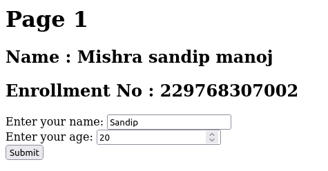
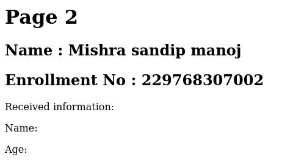
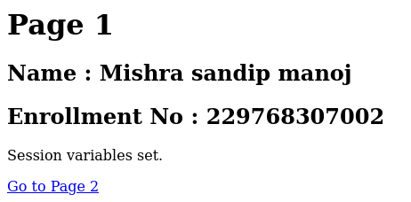
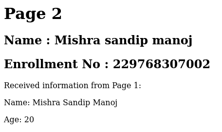
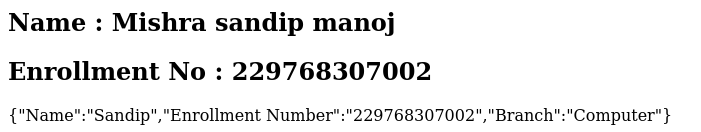

# 📝 PHP Assignment

🔮 Embark on a magical journey through PHP and elevate your coding skills with these captivating assignments! 🚀👩‍💻👨‍💻

## Section 31-35: **Web Alchemy & Data Enchantment**

31. **Employee Enigma** 👤
   - Craft an enchanting web page to gather the essence of employees' information.
   - [Link](./31-35/31.php)
   - **Input:**
     
   - **Output:**
     

32. **URL Unveiling** 🔗
   - Unveil the magical threads of information passing between web pages using URL-Get method.
   - [Link](./31-35/32.php)
   - **Input:**
     
   - **Output:**
     

33. **Hidden Communication** 🕶️
   - Communicate in shadows with hidden variables, passing secrets between web pages using the Post method.
   - [Link](./31-35/33.php)
   - **Input:**
     
   - **Output:**
     

   - **Input:**
     
   - **Output:**
     

34. **Session Saga** 🕐
   - Embark on a time-traveling journey with the art of Session, where data is preserved through mystical time loops.
   - [Link](./31-35/34.php)
   - **Input:**
     
   - **Output:**
     

   - **Input:**
     
   - **Output:**
     

35. **JSON Jigsaw** 🧩
   - Assemble the pieces of data into the mosaic of JSON, decoding and encoding arrays with eldritch precision.
   - [Link](./31-35/35.php)
   - **Input:**
     
   - **Output:**
     
